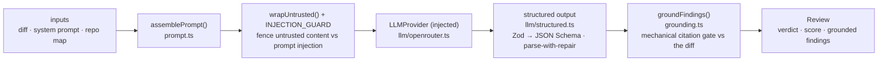

# `@devdigest/reviewer-core` — the review engine

Pure review logic: **diff → prompt → LLM → grounded findings**. No database,
GitHub, or filesystem; the only side effect is an LLM call through an **injected**
`LLMProvider`, which is what makes it mock-testable.

In the starter the **server** (`@devdigest/api`) is its only consumer — for local
reviews in the studio. (The CI runner that runs the same engine in GitHub Actions
is added back in the Export-to-CI lesson, L06.) The server wires it via a tsconfig
path alias (`@devdigest/reviewer-core` → `../reviewer-core/src`) and consumes the
TypeScript **source** directly (tsx in dev, vitest in tests). The package never
emits JS — its `build` is a type-check.

## Pipeline

The grounding step is the mandatory gate: a finding that doesn't cite a real line
in the diff is dropped, so the engine can't hallucinate locations. The score is
recomputed deterministically from the **surviving** findings, not trusted from the
model. `review/run.ts` orchestrates the run (single-pass by default).

The engine also accepts optional prompt slots the **course lessons** start
feeding it — `skills` (L02), `memory` (L07), `specs` (L05), `callers` — plus a
`reduce()`/map-reduce path and a `toReview()` CI payload helper used from L06.
In the starter the server passes only the diff, system prompt, and repo map; the
extra slots are omitted, so `assemblePrompt` simply leaves those sections out.

## Public API

Exported from `src/index.ts`: `assemblePrompt` / `wrapUntrusted` (prompt),
`groundFindings` / `groundingSummary` (grounding), `toJsonSchema` / `extractJson`
/ `parseWithRepair` (structured output), plus the `run` entrypoint and
`reduce`. Contracts (`Review`, `Finding`, `Verdict`, …) come from
`@devdigest/shared`.

`parseDiff` / `parseUnifiedDiff` (L03 — `diff/parse.ts`) are the count-driven
unified-diff parser: `parseDiff` returns every line with its kind and new-file
line number, counting each hunk's body against its `@@` header rather than
scanning for the next header; `parseUnifiedDiff` maps that onto the
`@devdigest/shared` `UnifiedDiff` contract. `numberDiff` (`review/numbered-diff.ts`)
and `sliceDiff` (`review/reduce.ts`) are both rendered from that one parse, so
they can never disagree with each other or with grounding — `sliceDiff` matches
the file whose path is EXACTLY the requested path, never a substring (a request
for `x.ts` never also pulls in `sub/b/x.ts`). `run.ts` numbers every diff
before it reaches the LLM, and `assemblePrompt` adds a trusted rule telling the
model to cite those printed numbers (see `docs/agent-prompts/README.md` §
Numbered diff). In map-reduce every file gets its own chunk, deleted and
deletions-only files included: removed code can be the defect. A hunk with no
new-side line prints its declared new start on its `@@` line (`0` for a deleted
file) — the number the model cites for that removed code, and the one line
grounding accepts for such a hunk.

`estimateTokens` and the optional `promptTelemetry` on `ReviewInput`
(L03 — prompt logging) let a caller observe prompt-assembly metadata —
`PromptSection[]` / `PromptAssembledInfo` (name, source, role, untrusted,
chars, `tokens_est`) — through `onPrompt`, **never section text**. The engine
stays I/O-free: a fingerprint hasher, when wanted, is injected by the caller.

## Testing

`npm test` (vitest) — hermetic units with a stubbed `LLMProvider`: prompt
assembly, the grounding gate, `toReview` selection, and a full `run`. No keys,
no network. `npm run typecheck` doubles as the build. See
[`../TESTING.md`](../TESTING.md).
