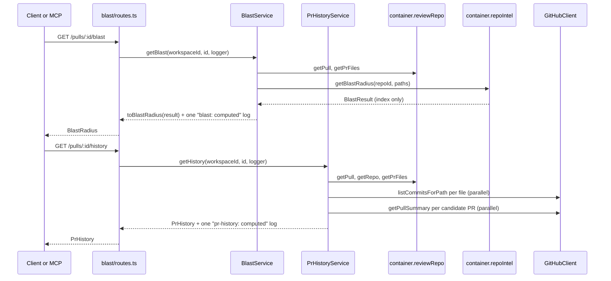

# Blast radius and prior PRs — how it works

Explanation of the two routes of the `blast` module
(`server/src/modules/blast/`). The facade's own semantics (degradation reasons,
hops, limits) are in
[`repo-intel/README.md`](../src/modules/repo-intel/README.md) § `getBlastRadius`.

## Request flow

Not rendered here; syntax checked by hand.

## `GET /pulls/:id/blast`

- A PR that is unknown or in another workspace gives 404
  `Pull request not found` (`blast/service.ts:22`).
- The service passes the PR's changed file paths to `repoIntel.getBlastRadius`
  and maps the result with `toBlastRadius` (`service.ts:25-27`).
- `toBlastRadius` (`blast/helpers.ts:17`) groups callers by `viaSymbol` into
  `downstream[]` and builds `summary`; `blastCounts` (`helpers.ts:81`) gives the
  counts used in the log.
- One `blast: computed` log line per request, with `correlationId`, `source`,
  `degraded`, `reason`, `indexedSha` and the counts (`service.ts:29-45`).

## `GET /pulls/:id/history`

- The route has its own limit of 20 requests per minute (`routes.ts:33`).
- Files are sorted by additions + deletions (desc), then path; the first
  `MAX_HISTORY_FILES` = 20 are used (`history.ts:53-58`, `constants.ts:8`). No
  files gives `{ history: [] }` with no GitHub call.
- Commits come from GitHub (`commits?path=` on the repo's default branch,
  `HISTORY_COMMITS_PER_FILE` = 30), never from the shallow clone
  (`history.ts:73-76`).
- PR numbers are parsed from the first line of each commit message
  (`prNumbersFromMessage`, `helpers.ts:108`, used at `history.ts:89`); the
  current PR is skipped. The newest `MAX_HISTORY_PRS` = 10 candidates get one
  `getPullSummary` each (`history.ts:103`); unmerged PRs are dropped
  (`history.ts:115`).
- `notes` is derived from the PR body by `notesFromBody` (`helpers.ts:122`) and
  truncated to `HISTORY_NOTES_MAX_CHARS` = 200.
- Degradation: `github()` throwing, or every commit call failing, gives
  `degraded: true, reason: 'github_unavailable'` (`history.ts:67,80`); some
  calls failing gives `reason: 'github_partial'` with the items that succeeded
  (`history.ts:128`).

## Consumers

- Client hooks: `usePrBlast`, `usePrHistory`
  (`client/src/lib/hooks/blast.ts:18,26`).
- MCP: `get_blast_radius` calls `GET /pulls/:id` (which refreshes `pr_files`) and then `GET /pulls/:id/blast`
  (`mcp-server/src/adapters/http/client.ts:107`).
