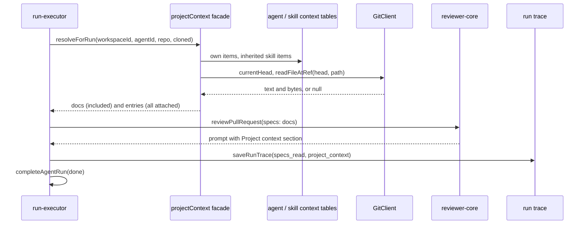

# Project Context — how a run gets its attached docs

Explanation of `server/src/modules/context/` (L05, spec:
[specs/L05-project-context.md](../../specs/L05-project-context.md)). It lets a
user attach a repo's markdown docs to an agent or a skill, and adds them to every
run's prompt. For the route table see [../README.md](../README.md#api-map); for
the prompt section order see
[../../docs/agent-prompts/README.md](../../docs/agent-prompts/README.md).

## What the module does

| Part | What | Where |
|---|---|---|
| Doc list | Every `.md` under a configured folder, read from the clone's HEAD commit (git objects, not the working tree), with `size`, `tokens`, `source`. | `service.ts:cachedList` |
| Attachments | Per-agent and per-skill lists of `{ path, position }`. Paths only, never doc text; `agents.update` / `skills.update` are not called, so `version` does not change. | `repository.ts`, `service.ts:setAgentContext` |
| Run resolution | `resolveForRun` returns the docs a run adds to its prompt, plus a trace entry per attached path. | `service.ts:resolveForRun` |

The module makes no LLM and no GitHub call.

## Run-time path

Not rendered (no renderer here); syntax checked by hand.

1. `run-executor.ts:237-243` calls `container.projectContext.resolveForRun`. The
   facade is `ProjectContextFacade` (`types.ts:9-22`); the executor never imports
   the module folder.
2. Order of docs (`service.ts:resolveForRun`): the agent's own items, then each
   inherited skill's items in link order; a path seen once is not repeated, so a
   doc attached directly and through a skill appears once with `via_skill: null`.
   Inside one list, `runOrder` puts positioned items first (by position), then
   unpositioned items by source name and path (`helpers.ts`).
3. Each path is read at the clone's HEAD with `readFileAtRef` and a 200,000-byte
   cap (`constants.ts:7`). Outcomes: `ok` becomes an included doc; `not_found`,
   `too_large` and `unreadable` become a `skipped` entry with `tokens: 0` and
   `text: null`. If the repo has no clone or HEAD cannot be resolved, every path is
   `not_found`. The method never throws; on an unexpected error it returns no docs.
4. The executor logs one summary line `Project context: <i> document(s) included
   (≈ <t> tokens), <k> skipped` and one `Project context: skipped <path> — <reason>`
   per skipped doc; nothing when there are no attachments
   (`run-executor.ts:244-254`).
5. Docs go to `reviewPullRequest` as `specs` only when there are any, so a run with
   no attachments has a prompt identical to before. reviewer-core wraps each as
   `<untrusted source="<path>">` under `## Project context`
   (`reviewer-core/src/prompt.ts:38-50,179`); the label has `"`, `<`, `>` removed.
   Docs travel inside the one existing prompt, so the LLM call count is unchanged.
6. The trace gets `specs_read` (included paths in prompt order) and, only when
   there is at least one entry, `project_context` (`run-executor.ts:368-369`).
   An entry's `text` is built with the same `renderProjectContextBlock` the prompt
   uses, so the two cannot drift.
7. The trace is saved **before** the terminal status. If the save fails on the
   success path the error is re-thrown, a fallback trace is saved and the run ends
   `failed` (`run-executor.ts:374-385`, catch at `:399`). A client that sees a
   terminal run never gets a 404 from `GET /runs/:id/trace`.

## The doc list and its cache

`GET /repos/:id/context` answers from `ContextService.cachedList`: it resolves the
repo (404 `Repository not found`; 422 `This repository has not been cloned yet.`),
reads `currentHead`, and reuses a `Map<repoId, { head, docs }>` entry while HEAD is
unchanged. On a miss it lists the tree with `GitClient.listFiles(ref, head)`,
keeps paths that pass `isDocPath` (lowercase `.md` under a configured folder,
case-sensitive), and reads them 8 at a time (`READ_CONCURRENCY`). A doc over the
cap, or one that fails the byte check, is listed with `tokens: null`.
`tokens` is `estimateTokens` (`ceil(chars / 4)`) of the text.

- One `ContextService` is built per app (`routes.ts:34`), so the cache lives for
  the process; a resync moves HEAD and the next call misses.
- `resolveForRun` does not use the cache: a run always reads the stored paths.
- `GET /repos/:id/context/file?path=` checks the path against the list first
  (404 `Document not found`), so nothing outside the list is read, and fills
  `used_by` (agents attaching the path directly or through a skill).
- `source` of a path is the first directory segment from the left that equals a
  configured folder (`helpers.ts:sourceOf`).

## Configuration

`PROJECT_CONTEXT_FOLDERS` (comma-separated, default `docs,specs`) is parsed in
`platform/config.ts:91-105`. A name that is empty or contains `/ * ? { } ,` or
`..` is ignored; if none remains the defaults are used. `app.ts:95-97` logs one
warning per ignored name. `GET /context/sources` returns the effective folders.

## Attachment rules

`PUT /agents/:id/context` and `PUT /skills/:id/context` take `{ items }`.
`isValidAttachmentPath` rejects an empty path, a leading `/` or `-`, a `..`
segment, a NUL or backslash, and a non-`.md` ending (422). `normalizeItems`
collapses repeated paths (first wins), rejects two equal positions (422), then
renumbers positions `0..n-1`. The replace is delete-then-insert in one
transaction. The tables have a primary key `(owner, path)`, a `position >= 0`
check and a partial unique index on `(owner, position) WHERE position IS NOT NULL`
(`server/src/db/migrations/0015_add_context_docs.sql`). Deleting an agent or skill
cascades to its rows. Agent responses also carry `inherited` (skills enabled on
the agent and globally that have at least one doc).

## Related

- [../../docs/shared-contracts.md](../../docs/shared-contracts.md) — the contracts
  (`ContextItem`, `AgentContext`, `ContextSources`, `ProjectContextEntry`) live in
  both vendored copies.
- [../../client/README.md](../../client/README.md) — the page and the Context tabs.
