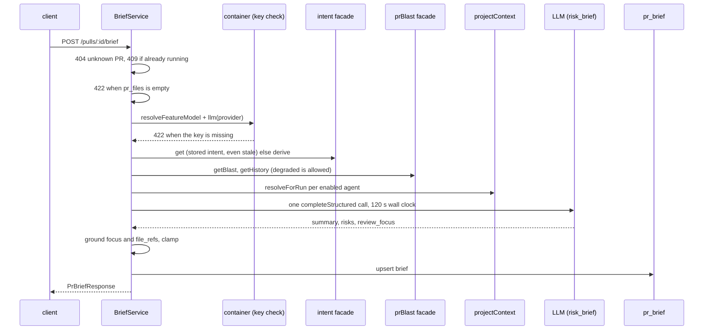

# Risk Brief — how a PR brief is built

Explanation of `server/src/modules/brief/` (L05, spec:
[specs/L05-risk-brief.md](../../specs/L05-risk-brief.md)). It serves
`GET` and `POST /pulls/:id/brief` (`routes.ts`). For the route map see
[../README.md](../README.md#api-map); for why `pr_files` must be filled first see
[pull-files.md](pull-files.md).

## What the module does

| Part | What | Where |
|---|---|---|
| Read | `GET` returns the stored brief plus `generating` and `stale`. It calls no model, no GitHub and no index. | `service.ts:getState` |
| Generate | `POST` collects facts, makes ONE structured model call, checks the answer against the diff, stores it. Synchronous. | `service.ts:run` |
| Cache | One row per PR in `pr_brief`, the whole brief in the `json` column; `save` is an upsert on the PR id. | `repository.ts:save` |

`stale` is true when the brief's `generation.head_sha` differs from
`pull_requests.head_sha`, and false when there is no brief
(`helpers.ts:toBriefResponse`). `GET /pulls/:id` writes `head_sha`
(see [pull-files.md](pull-files.md)). A stored JSON that no longer parses gives
`brief: null` and one `brief: unreadable` warn line (`service.ts:getState`).

## Generate flow

Order and guards, in `service.ts`:

- The unknown-PR 404 comes first, then the in-process guard: a second POST for
  the same PR gets 409 `brief_in_progress` (`:82`). The guard is a `Set` in the
  one `BriefService` per app, so it is lost on restart.
- No `pr_files` rows: 422 before anything else (`:116`).
- The model and key are resolved before intent or blast work, so a missing key
  makes no intent call; a `ConfigError` becomes a 422 (`:119-126`).
- A stored intent is used as it is, even when stale; otherwise one is derived
  (`resolveIntent`).
- Docs: every enabled agent, sorted by name then id; each path is kept once
  (`collectDocs`).
- Any failure after the guard is taken logs one `brief: failed` line (`code`,
  `status`, `reason`, `durationMs`) and keeps the stored brief (`:88-96`). A
  success logs `brief: generated` with counts, never text.

## The facts block

`buildBriefFacts` (`helpers.ts`) builds one JSON payload that
`prompt.ts:buildBriefMessages` wraps in a single `<untrusted>` block; the model
has no tools. The limits are literals in `constants.ts`:

| Limit | Value |
|---|---|
| Payload `JSON.stringify(...).length` | 45,000 (`MAX_FACTS_CHARS`) |
| Docs | 3, each 8,000 chars, 16,000 in total |
| A path list | 100 paths or 4,000 summed path chars |
| History items | 10 |

Blast, history and docs are measured first. The diff fills what is left, files
in role order `core, tests, wiring, docs` (`DIFF_ROLE_ORDER`); the first patch
that does not fit is cut to the longest prefix that does, and no further patch is
added. `blast.incomplete` and `history.incomplete` (plus a reason) tell the model
a degraded input was partial. The PR title and body are not sent.

## Grounding and clamping

The model's answer is never stored as given.

| Step | Rule | Where |
|---|---|---|
| Hunk ranges | A hunk `@@ -a,b +c,d @@` covers new-side lines `[c, c+d-1]`; `d` defaults to 1; `d=0` is empty. | `helpers.ts:newSideRanges` |
| Review focus | Kept only if the file is changed, has a patch, and the line is in one of its ranges; a repeated `file:line` is dropped (first wins). | `helpers.ts:groundFocus` |
| `file_refs` | A `:n` or `:n-m` suffix is stripped; only changed paths stay, each once. A risk whose list ends empty is kept. | `helpers.ts:groundRisks` |
| Clamp | Summary trimmed to 600 chars, at most 6 risks and 6 focus items, titles and reasons 160 chars, explanations 600, 6 refs per risk. | `helpers.ts:clampAnswer`, `constants.ts` |
| Empty summary | After trimming it is an error: 502, stored brief kept. | `service.ts:186`, `BRIEF_EMPTY_SUMMARY_MESSAGE` |

## The model call

`model-call.ts:callBriefModel` makes one `completeStructured` call with
`maxTokens` 6,000, `maxRetries` 1 and temperature 0. The 120 s deadline is a
`Promise.race`, because `timeoutMs` is per attempt and ignored on OpenRouter (see
[../INSIGHTS.md](../INSIGHTS.md) 2026-09-23); the abandoned request is not
cancelled. A failed call or a timeout is a 502. Cost and token counts are copied
from the provider result and a null cost stays null.

## Limits of the route

- `POST` is rate limited to 10 per minute (`BRIEF_RATE_LIMIT`); it is active only
  when `NODE_ENV !== 'test'`.
- The only sideways module import is `classifyFile` from
  `reviews/smart-diff/helpers.js` (`service.ts`, commented there as approved).
- No migration: the brief lives in the existing `pr_brief.json`.
