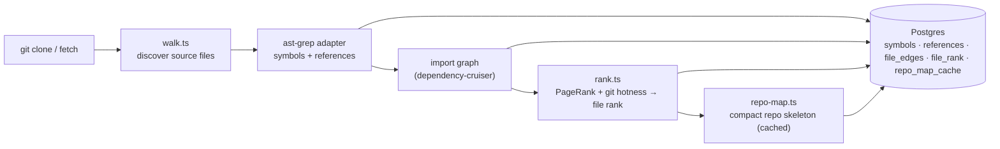

# `repo-intel` — the codebase indexer

`repo-intel` reads a cloned repository **once on clone** (and incrementally on
fetch, keyed by file content hash) and turns it into queryable facts: symbols,
the import graph, a PageRank-based file importance score, and a compact **repo
map** (the project skeleton). On a review it is only **read** — the index is
already computed, so adding context to a prompt costs no analysis at request time.

This is **starter infrastructure**: it works from day 1 (the **Indexed** badge),
but you don't write it. Course lessons build features _on top_ of its facade —
Blast Radius (L04), Conventions samples (L02), Onboarding reading-path (L05),
the Phantom-API gate (L06) — by calling `repoIntel.*`, not by re-indexing.

## Pipeline

Full vs incremental indexing lives in `pipeline/{full,incremental}.ts`; an
unindexed or partially-indexed repo degrades gracefully (the facade returns empty
results rather than throwing).

## Facade (`repoIntel.*`)

Everything downstream reads through one facade (`service.ts`) so consumers never
touch the pipeline internals:

- `getRepoMap(repoId)` → the cached repo skeleton (fed into the **review prompt**).
- `getFileRank(repoId, files)` → importance percentile per changed file.
- `getCallerSignatures(repoId, files, limit)` → callers of changed symbols.
- `getBlastRadius(repoId, files)` → changed symbols, callers and endpoints (consumed by the `blast` module, L04; see [`getBlastRadius`](#getblastradius)).
- `getUnresolvedReferences(repoId, …)` → phantom-symbol detection (used by L06).
- `getConventionSamples(repoId)` → top-ranked files for convention extraction (L02).

`getRepoMap` / `getFileRank` / `getCallerSignatures` are wired into
`modules/reviews/run-executor.ts`, which adds the repo map and a
high-blast-radius note to the prompt. Toggled by `REPO_INTEL_ENABLED` (global)
and a per-agent `repo_intel` flag.

## `getBlastRadius`

Consumed by the `blast` module (`GET /pulls/:id/blast`; flow in
[`server/docs/blast-radius.md`](../../../docs/blast-radius.md)). It reads **only
the persistent index** (symbols, resolved references, `file_rank`, `file_facts`):
no ripgrep, no `container.codeIndex`, no clone read (`service.ts:211-214`). It
never throws (`service.ts:252-254`).

**Degradation.** `degraded` / `reason` follow the index state; `reason` is a
`DegradedReason` (`types.ts:27-32`):

| Index state | Result (`service.ts:236-256`) |
|---|---|
| `REPO_INTEL_ENABLED` off | empty, `degraded`, `flag_off` |
| no `repo_index_state` row, or an internal error | empty, `degraded`, `no_data` |
| status `failed` / `degraded` | empty, `degraded`, the stored `degradedReason` (e.g. `repo_too_large`), else `index_failed` |
| `partial` | data, `degraded`, `index_partial` |
| `full` | data, `degraded: false`, no `reason` |

**Provenance.** `source` is `index` when the index was read, `none` otherwise;
`indexedSha` is `repo_index_state.last_indexed_sha`, omitted when empty
(`types.ts:93,95`).

**Callers.** Hop 1 is the resolved cross-file callers of the symbols declared in
the changed files. Each further hop up to `BFS_DEPTH` (`constants.ts:49`, = 2)
takes the previous hop's callers whose enclosing symbol was found and asks for
*their* callers; rows carry `depth` and, for depth >= 2, `through` (the earlier
caller they reach the symbol through). `MAX_CALLERS_PER_SYMBOL`
(`constants.ts:30`, = 20) is applied per changed symbol (`viaSymbol`) at hop 1
and per `viaSymbol` at each later hop (`service.ts:318,352`). Callers are sorted
by depth, rank desc, file, line; `factsByFile` carries the endpoints and crons
of every caller file.

## Routes

- `GET /repos/:id/index-state` — index status (drives the **Indexed** badge).
- `POST /repos/:id/resync` — enqueue a re-index.
