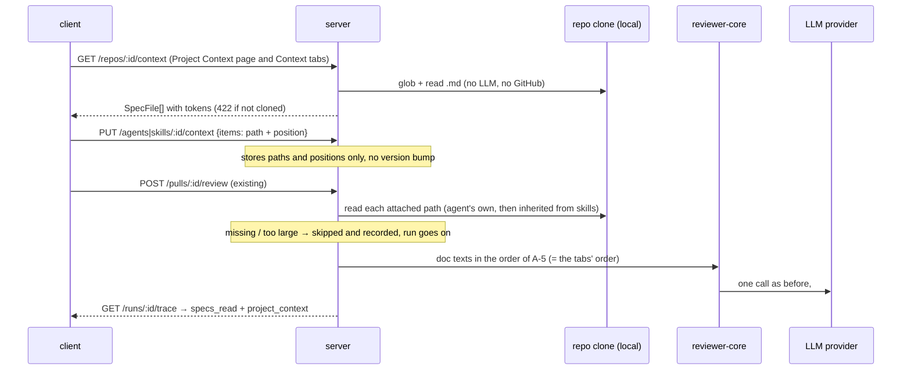

# Project Context — attach repo docs to agents and skills

**Status:** in-progress
**Lesson / ticket:** L05
**Packages:** server, client, reviewer-core (mcp-server and e2e unchanged)

## Goal
Reviewers judge a PR without the project's own specs and docs, so findings miss rules the team already wrote down. Users need to find the markdown docs in a repo, attach chosen ones to an agent or a skill in a set order, see in place how many tokens they add to each prompt, and have a run put their text into the prompt as untrusted data, with the Trace showing which docs went in and what they said. This uses the `## Project context` prompt slot and `specs_read` trace field, which exist but are always empty today (S-5, S-6). The user asked for the lightest version (S-1).

## Non-goals
- No editing, creating, uploading or deleting docs in the app (the N6 Edit / New file / Upload buttons, S-3). The clone is a read-only mirror, reset on every resync (S-9).
- No coverage score, chunk count, embeddings or separate context re-index (N6 "COVERAGE", "1,240 chunks", Re-index, S-3). The unserved client calls to `/repos/:id/context/reindex` stay unserved (S-8).
- No versioning of attachments or of document contents (S-1).
- No "Serializes as" path list inside the skill body (S-3 `context_docs.jsx:160`). Documents reach the prompt only as text under `## Project context` (S-1).
- No `insights/` source by default (it appears in S-3). The source folders are configurable (S-10).
- No `g`+letter keyboard shortcut for the Project Context nav item (S-10, user · 2026-10-06: not needed now).
- No LLM call for discovery, counting or attaching (S-1, S-2).
- No change to the CI runner, MCP tools, multi-agent views or built-in detectors.
- No control that returns every row to automatic order at once (inferred: the design has no such control). One row returns to its source group when it is dropped below the manual block, moved down from the last manual place, or unticked (A-23, A-25, A-28).

## Sources
| ID | Source | What it contributes |
|---|---|---|
| S-1 | request — user text, 2026-10-06 (translated from Ukrainian) | Placement (sidebar Workspace → Project Context; a Context tab in the agent and skill editors), the default glob `**/{specs,docs}/**/*.md`, drag-and-drop order, per-doc token count shown in place, paths stored instead of text, untrusted `## Project context` with the guard, skip-and-record for missing docs, `specs_read` with tokens, full text in Prompt assembly, no LLM call, no versioning |
| S-2 | design — Claude Design artifact https://claude.ai/artifact/7WfoegJ395FEWoqsZ9KykV ("DevDigest Field Manual"), saved at `<scratchpad>/design-project-context/engineering-review.txt` (lines ~111, ~365, ~640–720, ~1043, ~1121) | Project context is NO LLM. Docs are wrapped in `<untrusted source="…">` with `</untrusted>` escaped and the source label stripped of quotes and brackets. The section is "token-budgeted". Route `/repos/:id/context` |
| S-3 | design — Claude Design artifact https://claude.ai/artifact/949i8C4dnLUJnpsZFg4NHt (replaces https://claude.ai/artifact/BqxXf9ozS9CZtxzBKmYjCf; every Project Context module is byte-identical, and the additions are an unrelated PR Leaderboard screen), saved at `<scratchpad>/design-project-context/ui-v2/` (`chrome.jsx`, `screen_tour_context.jsx` N6, `context_docs.jsx`, `data_context.jsx`, `screen_agents.jsx`, `screen_skills.jsx`) | Sidebar item, N6 page (list plus preview; left "PROJECT CONTEXT" panel `screen_tour_context.jsx:240-244`), per-row source badge (`context_docs.jsx:5-9,36`), agent Context tab (N2b), skill Context tab (N2c): checkbox, drag handle, Preview drawer, filter, "≈ N tokens" total, 4,000-token soft-cap badge, tokens = len/4, "Any agent using this skill inherits these documents.", empty states |
| S-10 | request — user decisions, resolution round 3, 2026-10-06 | Search is built from a configured list of source folder names (default `docs`, `specs`) as `**/{<f1>,<f2>,…}/**/*.md`. Each document has a source. The Project Context panel shows a source badge per item, groups items by source and orders the groups by source name ascending. No nav shortcut for now |
| S-11 | request — user decisions, resolution round 4, 2026-10-06 | A-19, A-20, A-21 confirmed. P-3 accepted with the hybrid order: in both Context tabs, documents whose position the user set by hand come first, in ascending position, then every document with no position, grouped as in the Project Context panel. A position is set only by a manual reorder (drag-and-drop, Move up / Move down); ticking attaches with no position. Prompt order equals display order |
| S-4 | design — same artifact as S-3, `screen_trace.jsx:70-101`, `data2.jsx:46-51` | Trace: "Specs read" row; Prompt assembly block "Project context — attached specs (untrusted)" that expands to the full text; one `### <path>` per doc |
| S-5 | existing — `reviewer-core/src/prompt.ts:31-34` (`wrapUntrusted`, escapes `</untrusted>`), `:148` (guard appended to system), `:156-159` and `:213-219` (`## Project context`, label `spec-<i>`, omitted when empty) | The prompt slot and the delimiters already exist |
| S-6 | existing — `server/src/modules/reviews/run-executor.ts:220-230` (enabled skills in link order), `:355` (`specs_read: []`); `server/src/vendor/shared/contracts/trace.ts:89` (`specs_read: string[]`, client twin `:88`) | The run never fills specs. The trace field exists |
| S-7 | existing — `server/src/vendor/shared/contracts/platform.ts:308-315` `SpecFile` (client twin, same lines) | The contract exists. No route serves it: `grep app.get` over `server/src/modules/` finds no `/repos/:id/context` |
| S-8 | existing — `client/src/vendor/ui/nav.ts:22-27` (WORKSPACE has only Pull Requests), `client/src/components/app-shell/helpers.ts:30` (`/context` → `context`), `client/messages/en/shell.json:20`, `client/messages/en/context.json`, `client/src/lib/hooks/core.ts:122-135` (hooks with no route behind them), `client/src/app/repos/[repoId]/pulls/[number]/_components/RunTraceDrawer/_components/TraceBody/TraceBody.tsx:39-50, 85-87`, `client/messages/en/runs.json:35,51`, agent `SkillsTab.tsx:5,49,111-122,135` (drag, Move up/down, Save) | UI that is already there and the patterns the new tabs follow |
| S-9 | existing — `reviewer-core/src/prompt-meta.ts:22` (`ceil(chars/4)`), `server/src/modules/intent/constants.ts:18` (`MAX_SPEC_BYTES = 200_000`), `server/src/modules/conventions/service.ts:186-187` ("This repository has not been cloned yet."), `server/src/adapters/git/simple-git.ts:93-99` (resync = `reset --hard` of a read-only mirror), `:147` (path guard), `server/src/platform/config.ts:28` (env feature flags) | Token formula, size cap, clone-missing wording, clone semantics, path rules |

## User stories
### US-1 — Browse project documents (P1)
As a reviewer owner, I want to see every spec and doc in the repo with its token size, so that I know what I can attach.
**Independent test:** on a cloned repo with `specs/a.md` and `docs/b.md`, open Project Context. Both are listed with token counts, and selecting one shows its text.

### US-2 — Attach and order documents on an agent (P1)
As an agent owner, I want to tick docs, drag them into order and see the token total before saving, so that I control what each run adds and what it costs.
**Independent test:** attach two docs, swap them by dragging, save and reload. The order holds and the total equals the sum of the two counts.

### US-3 — Attach documents to a skill (P2)
As a skill author, I want to attach docs to a skill, so that every agent using the skill gets them.
**Independent test:** attach a doc to a skill that is linked to an agent. That agent's Context tab shows one inherited doc, and its next run includes that doc.

### US-4 — Documents reach the run prompt (P1)
As an agent owner, I want the attached docs added as untrusted text when a run starts, so that findings respect the project's written rules without an extra model call.
**Independent test:** run an agent that has one present doc and one deleted doc. The prompt holds the present doc in an untrusted block, the run succeeds, and the deleted doc is recorded as skipped.

### US-5 — See what was added (P1)
As a reviewer, I want the Trace to list the docs that were read, with their tokens, and to open each doc's full added text, so that I can audit the prompt.
**Independent test:** open that run's Trace. "Specs read" shows the included path with its tokens and the skipped path as skipped. In Prompt assembly, the doc's entry opens its full text.

## Contract
- **Routes** (all scoped to the workspace; a non-uuid id → 422):
  - `GET /repos/:id/context` → 200 `SpecFile[]`: every `.md` file in the clone under a configured source folder, sorted by `path` ascending. Each item has `path` (repo-relative), `source` (the configured folder name it was matched under, A-19), `size` (bytes) and `tokens` (null for a doc over 200,000 bytes or one that cannot be read, A-30), with `content` and `used_by` null (A-31). Unknown or other-workspace repo → 404. Repo not cloned → 422 `This repository has not been cloned yet.`
  - `GET /repos/:id/context/file?path=
` → 200 `SpecFile` with `content` and `used_by`; a doc over 200,000 bytes comes with `content` and `tokens` null (A-31). If `
` is not in the discovered list → 404.
  - `GET /context/sources` → 200 `ContextSources` = `{ folders: string[] }`: the configured source folder names in effect (the default list when none is valid). Plan-originated (plan GT-4 · user · 2026-10-06, A-32).
  - A `ContextItem` is `{ path: string, position: int ≥ 0 | null }`; `position` is null until the user moves the row by hand (S-11, A-27).
  - `GET /agents/:id/context` → 200 `AgentContext` = `{ items: ContextItem[], inherited: { skill_id, skill_name, items: ContextItem[] }[] }`. `PUT /agents/:id/context` with body `{ items: ContextItem[] }` → 200 `AgentContext`. Unknown agent → 404 `Agent not found`. Invalid path or position → 422.
  - `GET /skills/:id/context` → 200 `{ items: ContextItem[] }`. `PUT /skills/:id/context` with body `{ items }` → 200 the same shape. Unknown skill → 404 `Skill not found`. Invalid path or position → 422.
  - Every `items` list in a response comes positioned items first by `position`, then the null ones by path ascending (A-27).
- **Shared contracts** (both vendored copies, `server/src/vendor/shared/` and `client/src/vendor/shared/`, additive and optional): `SpecFile` gains `tokens: int nullish`, `source: string nullish` (S-10) and `used_by: int nullish` (P-1). New `ContextItem`, `ContextPaths` = `{ items: ContextItem[] }`, `AgentContext` (as above) and `ContextSources` = `{ folders: string[] }` (plan GT-4, A-32). `RunTrace` gains `project_context?: { path, tokens: int, status: 'included' | 'skipped', reason?: 'not_found' | 'too_large' | 'unreadable', via_skill: { id: string, name: string } | null, text: string | null }[]`. `text` is the exact block added to the prompt, and it is null when the doc is skipped.
- **Configuration:** a server setting holds a list of source folder names. The search glob is built from it as `**/{<f1>,<f2>,…}/**/*.md`. The default list `docs`, `specs` gives the same match as `**/{specs,docs}/**/*.md` (S-1, S-10, A-1, A-21). The setting is the env variable `PROJECT_CONTEXT_FOLDERS`, comma-separated (A-29).
- **UI surface:** sidebar WORKSPACE → "Project Context" (`/repos/:repoId/context`). Agent editor tab "Context", placed after "Skills". Skill editor tab "Context", placed after "Config". In the Trace drawer, the "Specs read" row and the Prompt assembly block change.
- **Persistence:** for each agent and each skill, its set of attached repo-relative paths, each with a nullable manual position (S-11). No document text is stored. Storing these lists needs new storage, which means a **migration: a user gate**. Saving attachments creates no agent or skill version (S-1). The trace stays one jsonb document and gains the `project_context` field (no migration). Scope (user · 2026-10-06, A-15): attachments belong to an agent or a skill across all repos, with no repo key. Paths are resolved in each PR's repo, and a missing one is skipped and recorded.
- **MCP tools:** none.

### Module interaction

## Acceptance criteria
- **AC-1** (US-1 · S-1) The sidebar SHALL show "Project Context" in the WORKSPACE section, linking to `/repos/<active repo id>/context` (existing label S-8).
- **AC-2** (US-1 · S-1, S-7) WHEN `GET /repos/:id/context` is called for a cloned repo, the server SHALL return 200 with one `SpecFile` per `.md` file under a configured source folder, sorted by path ascending.
- **AC-3** (US-1 · S-10, A-1) WHERE no source folders are configured, the server SHALL use the list `docs`, `specs`, matching `**/{docs,specs}/**/*.md`.
- **AC-4** (US-1 · A-4, A-30) The server SHALL report each document's `tokens` as `ceil(characters / 4)` of its text, and as null for a document over 200,000 bytes or one that cannot be read.
- **AC-5** (US-1 · S-3) WHEN the user selects a document on the Project Context page, the page SHALL show its path, its token count and its rendered markdown.
- **AC-6** (US-1 · S-3) WHEN the user types in the page's filter, the page SHALL list only documents whose path contains the text, ignoring case.
- **AC-7** (US-1 · S-9) IF the repo has no clone, THEN the server SHALL return 422 `This repository has not been cloned yet.`
- **AC-8** (US-1 · S-8) IF the list request fails, THEN the page SHALL show "Couldn’t load specs" and a Retry button.
- **AC-9** (US-1 · S-3, A-32) IF no document matches, THEN the page SHALL show "No documents found" and a body that names the source folders returned by `GET /context/sources` and says to resync the repo.
- **AC-10** (US-1 · S-2) IF `GET /repos/:id/context/file` gets a path that is not in the discovered list (outside the source folders, absolute, or with a `..` segment), THEN the server SHALL return 404 and read no file.
- **AC-11** (US-2 · S-1, S-11) The agent editor SHALL show a "Context" tab after "Skills" that lists the active repo's documents, starting with the documents that have a manual position, in ascending position order (the manual block).
- **AC-12** (US-2 · S-3, S-11) WHEN the user ticks an unattached document, the Context tab SHALL mark it attached with no manual position, leaving it in its source group at its path order.
- **AC-13** (US-2 · S-1, S-11, A-23) WHEN the user drops an attached document on another row of the manual block, the Context tab SHALL put it in that row's place, so that row and the rows below it in the block move down one place.
- **AC-14** (US-2 · S-8, A-23) WHILE the filter is not empty, the Context tab SHALL disable dragging and the Move buttons on every row, in the manual block and in the source groups, and say why.
- **AC-15** (US-2 · S-1, A-34) The Context tab SHALL show each document's token count and "≈ <total> tokens", where the total is the A-34 sum of the tab's own attached documents and the inherited ones.
- **AC-16** (US-2 · S-3, A-34) WHILE the A-34 total (own attached plus inherited documents) is above 4,000 tokens, the Context tab SHALL show a badge reading "over 4K soft cap".
- **AC-17** (US-2 · S-3) WHEN the user clicks Preview on a row, the editor SHALL open a drawer showing the document's path, token count, full rendered text and an Attach / Attached toggle.
- **AC-18** (US-2 · A-6, S-11) WHEN the user clicks Save, the client SHALL send `PUT /agents/:id/context` with every attached path and its manual position (null where none is set) and show a success toast.
- **AC-19** (US-2 · S-1, S-11, A-27) WHEN `PUT /agents/:id/context` succeeds with distinct paths and positions numbered 0..n-1, a following `GET` SHALL return the same paths with the same positions, nulls included.
- **AC-20** (US-2 · S-1) WHEN agent or skill attachments are saved, the server SHALL leave that agent's or skill's `version` and its version history unchanged.
- **AC-21** (US-2 · A-12) IF a PUT body holds a path that is absolute, has a `..` segment or does not end in `.md`, THEN the server SHALL return 422 and store nothing.
- **AC-22** (US-2 · A-8, A-27, A-35) WHEN a PUT body repeats a path, the server SHALL store it once, with the position of its first occurrence in the body.
- **AC-23** (US-2 · S-1) IF an attached path is not among the active repo's documents, THEN the Context tab SHALL render that row labelled "Not found in <repo>", with no token count and with its detach control.
- **AC-24** (US-2 · A-5, A-36) WHERE the agent's enabled skills carry attached documents, the Context tab SHALL show a read-only line "Inherited from skills: <n> documents · ≈ <t> tokens", with n and t as A-36 defines them.
- **AC-25** (US-2 · A-9) IF no repository is connected, THEN the Context tab SHALL list the attached paths without token counts and show a hint to add a repository.
- **AC-26** (US-3 · S-1) The skill editor SHALL show a "Context" tab after "Config" with the list, attach, reorder, token, soft-cap, preview, not-found and no-repo behaviour of AC-11 to AC-17, AC-23, AC-25 and AC-62 to AC-69, saving with `PUT /skills/:id/context`.
- **AC-27** (US-3 · S-3) The skill Context tab SHALL show the text "Any agent using this skill inherits these documents."
- **AC-28** (US-4 · S-1, S-11, A-5, A-15) WHEN a run starts for an agent with attachments, the server SHALL read each path from the clone of the PR's repository, in the order of A-5.
- **AC-29** (US-4 · S-5) WHEN at least one document is read, the prompt's user message SHALL contain one `## Project context` section with each document in its own `<untrusted source="<path>">` block, in that order.
- **AC-30** (US-4 · S-2) The server SHALL remove `"`, `<` and `>` from a path before the path is used as a `source` label.
- **AC-31** (US-4 · S-1) IF an attached path does not exist in the clone, THEN the server SHALL skip it, finish the run, and record the path in `project_context` with `status: 'skipped', reason: 'not_found'`.
- **AC-32** (US-4 · A-7) IF a document is larger than 200,000 bytes, THEN the server SHALL skip it and record `reason: 'too_large'`.
- **AC-33** (US-4 · S-2) The server SHALL read only the stored paths, never a file that a document links to or names.
- **AC-34** (US-4 · A-16) WHEN a run starts, the server SHALL include every attached document whatever the token total, skipping only those recorded as `not_found`, `too_large` or `unreadable`.
- **AC-35** (US-5 · S-6) WHEN a run completes, its trace `specs_read` SHALL list the paths of the included documents in prompt order.
- **AC-36** (US-5 · S-1, A-38) WHEN a run with attachments completes, its trace `project_context` SHALL hold one entry per attached path with `tokens` (0 for skipped ones), `status`, `via_skill`, and `text` for included ones.
- **AC-37** (US-5 · S-4) The Trace's "Specs read" row SHALL show each included path with "≈ <n> tokens" and each skipped path with "skipped — not found", "skipped — too large" or "skipped — unreadable".
- **AC-38** (US-5 · S-4) WHERE a trace has included documents, Prompt assembly SHALL show a block "Project context — attached specs (untrusted)" with one entry per document (path and tokens).
- **AC-39** (US-5 · S-1) WHEN the user opens a document entry in that block, the drawer SHALL show that document's full text exactly as it was added to the prompt.
- **AC-46** (US-1 · S-9) WHEN the list request returns 422, the Project Context page SHALL show the server's message.
- **AC-47** (US-2 · S-1) The server SHALL store attachments as paths only, with no document text.
- **AC-48** (US-1 · P-1 · user, A-41) WHEN the user selects a document on the Project Context page, the page SHALL show "Used by <n> agents", where n counts the workspace's agents, enabled or not, whose runs would include the path (A-17, A-41).
- **AC-49** (US-2 · P-1 · user) WHEN the Preview drawer opens, it SHALL show "Used by <n> agents" for that document (A-17, A-41).
- **AC-50** (US-5 · P-2 · user, A-39) WHERE the Trace's "Specs read" row shows a skipped path and the run has an agent id, the Trace SHALL show a "Remove from agent" link next to it, which reads "Remove from skill <name>" when the entry has a `via_skill`.
- **AC-51** (US-5 · P-2 · user) WHEN the user follows that link, the client SHALL open the Context tab of the run's agent, or of the skill in `via_skill` (A-18).
- **AC-52** (US-1 · S-10, A-19) WHEN the server lists a document, it SHALL set `source` to the configured folder name the document was matched under.
- **AC-53** (US-1 · S-10, S-3) The Project Context page's left panel SHALL show, at the right end of each document item, a badge whose text is the item's `source`.
- **AC-54** (US-1 · S-10, A-20) The Project Context page's left panel SHALL group items by `source` under a heading with the source name, order the groups by source name ascending, and order items by path ascending within a group.
- **AC-55** (US-1 · S-10, A-21, A-29) WHERE source folders are configured, the server SHALL match `.md` files under a folder of any of those names, at any depth (`**/{<f1>,<f2>,…}/**/*.md`), comparing folder names and the lowercase `.md` extension case-sensitively.
- **AC-56** (US-2 · P-3 · user) The agent Context tab SHALL show, at the right end of each row that has a `source`, a badge whose text is that `source`.
- **AC-57** (US-2 · P-3 · user, S-11, A-20, A-22) The agent Context tab SHALL list every document with no manual position, attached or not, below the manual block, grouped by `source` under source-name headings, with groups by source name ascending and items by path ascending.
- **AC-58** (US-3 · P-3 · user, S-11, A-22) The skill Context tab SHALL show the badge of AC-56, the manual block of AC-11 and the grouping of AC-57.
- **AC-59** (US-2 · P-3 · user) WHEN the Preview drawer opens for a document, it SHALL show a badge whose text is the document's `source`.
- **AC-60** (US-2 · A-27, A-35) IF a PUT body holds a position that is negative or not an integer, or two distinct paths with the same position after repeated paths are collapsed, THEN the server SHALL return 422 and store nothing.
- **AC-61** (US-2 · A-27) WHEN a PUT body's positions have gaps, the server SHALL store them renumbered 0..n-1, keeping their ascending order.
- **AC-62** (US-2 · S-11, A-23) WHEN the user drops an attached document on the first row below the manual block, the Context tab SHALL put it last in the manual block.
- **AC-63** (US-2 · S-11, A-23) WHEN the user drops an attached document on any other row below the manual block, the Context tab SHALL clear its manual position and show it in its source group at its path order.
- **AC-64** (US-2 · A-23) WHEN a row joins or leaves the manual block, or moves within it, the Context tab SHALL renumber the manual positions 0..n-1 from the top of the block.
- **AC-65** (US-2 · A-24) The Context tab SHALL show no drag handle and no Move up / Move down buttons on an unattached row.
- **AC-66** (US-2 · A-25) WHEN the user unticks a document that has a manual position, the Context tab SHALL clear its position, so that ticking it again shows it in its source group.
- **AC-67** (US-2 · S-11, A-23) WHEN the user activates Move up on an attached row with no manual position, the Context tab SHALL put it last in the manual block.
- **AC-68** (US-2 · S-11, A-23) WHEN the user activates Move down on the last row of the manual block, the Context tab SHALL clear its manual position and show it in its source group.
- **AC-69** (US-2 · A-26) WHERE an attached path is "Not found in <repo>" (AC-23) and has no manual position, the Context tab SHALL list it after the last source group, by path ascending.
- **AC-70** (US-2 · A-33) IF the document list request fails in a Context tab, THEN the tab SHALL show the error message and still render the attached rows without token counts, as in AC-25.
- **AC-71** (US-4 · A-37) IF the PR's repository has no clone, or its checkout cannot be resolved, THEN the server SHALL record every attached path as `skipped` with `reason: 'not_found'` and finish the run.
- **AC-72** (US-4 · A-38) IF a document's bytes are not valid UTF-8, or reading it fails, THEN the server SHALL skip it and record `reason: 'unreadable'`.
- **AC-73** (US-1 · A-32) WHEN `GET /context/sources` is called, the server SHALL return 200 `{ folders }` with the configured folder names in effect, `["docs", "specs"]` when none is valid.
- **AC-40** (US-5 · A-3) WHILE a document's file is unchanged in the clone, the token count in the trace SHALL equal the count the Context tab shows for it.

### Must keep working
- **AC-41** (existing · `reviewer-core/src/prompt.ts:156-159`) WHEN an agent has no attachments, or every attachment is skipped, the prompt SHALL CONTINUE TO have no `## Project context` section and stay byte-identical to today's prompt.
- **AC-42** (existing · `reviewer-core/src/prompt.ts:33`) WHEN a document contains `</untrusted>`, the prompt SHALL CONTINUE TO hold it escaped as `<\/untrusted>`.
- **AC-43** (existing · `reviewer-core/src/prompt.ts:148`) WHEN any run is assembled, the system message SHALL CONTINUE TO end with the injection guard.
- **AC-44** (existing · `TraceBody.tsx:41-42`) WHEN a trace has no `project_context` (older runs) and an empty `specs_read`, the Trace SHALL CONTINUE TO show "none" for Specs read and render without error.
- **AC-45** (existing · `run-executor.ts:220-230`) WHEN a run starts, skill bodies SHALL CONTINUE TO enter `## Skills / rules` in link order, for enabled links of enabled skills only.

## States and edge cases
| Surface | Default | Loading | Empty | Error | Partial / degraded | No access | Stale / expired |
|---|---|---|---|---|---|---|---|
| Project Context page | AC-2, AC-5, AC-53, AC-54 | skeleton → A-10 | AC-9 | AC-7, AC-46, AC-8 | doc over 200 KB listed, but a run skips it → AC-32 | other-workspace repo → 404, existing not-found screen (A-10) | shows the clone as of the last resync → A-2 |
| Agent Context tab | AC-11–AC-15, AC-56, AC-57, AC-62–AC-68; no manual position yet → no manual block, all rows grouped (A-22) | A-10 | no docs → AC-9 wording; none attached → AC-12 | save fails → error toast, draft kept (A-6); bad position → 422 (AC-60); list fails → AC-70 | AC-23, AC-25, AC-69; filter on → reorder off (AC-14) | unknown agent → 404 (Contract) | AC-23, AC-69 |
| Skill Context tab | AC-26, AC-27, AC-58 | A-10 | as the agent tab (AC-26) | as the agent tab (A-6) | AC-23 via AC-26 | unknown skill → 404 (Contract) | AC-23 via AC-26 |
| Run (server) | AC-28, AC-29 | n/a | AC-41 | AC-31, AC-32, AC-71, AC-72 | AC-31 | n/a | edits during a run apply to the next run → A-11 |
| Trace drawer | AC-37–AC-39 | n/a (existing drawer) | AC-44 | n/a (existing) | AC-37, AC-50, AC-51 skipped rows | n/a (existing) | AC-44 |

Other edge cases: a path under two configured folders (`docs/specs/x.md`) is listed once, with the outermost folder as its source (A-19). Filtering hides groups that have no matching items (A-20). A doc that is also inherited is included once (A-5). Detaching a skill drops its inherited docs from the next run (A-5). Deleting an agent or skill removes its attachments. Filenames with quotes are covered by AC-30. Non-UTF-8 or unreadable files are recorded as `unreadable` (AC-72, AC-37). Ordering (S-11): dragging a row onto itself changes nothing; dropping a row with no position deep in the groups changes nothing (AC-63); with an empty manual block, the first row of the list is the drop target that starts it (AC-62); a positioned row that is "Not found" keeps its place in the manual block and is skipped in the run (AC-23, AC-31); a change of the configured folders can move a row with no position to another group, while a positioned row stays put (A-5); while filtering, the hidden rows keep their positions (AC-14).

## Non-functional
- **NFR-1** (LLM cost · S-1) WHEN docs are listed, previewed, counted or attached, the server SHALL make 0 LLM calls.
- **NFR-8** (LLM cost · S-1, S-2) WHEN a run with attachments executes, the server SHALL make the same number of LLM calls as the same run without them. The added input tokens are paid with the agent's provider key.
- **NFR-2** (privacy · S-1) WHEN docs are listed, previewed or attached, the server SHALL send no request to GitHub or to any LLM provider. (Document text leaves the machine only inside a run's prompt, sent to the agent's own provider.)
- **NFR-3** (untrusted input · S-2) IF a document holds raw HTML or a `<script>` element, THEN the Project Context page, the Preview drawer and the Trace SHALL display it as text and run no script.
- **NFR-4** (accessibility · A-13, A-23) The Context tabs SHALL offer "Move <path> up" and "Move <path> down" buttons on each attached row, labelled with `aria-label`, that move a manual-block row one place and otherwise act as AC-67 and AC-68, disabled where A-23 gives them no effect.
- **NFR-5** (accessibility · S-3) WHILE the soft cap is exceeded, the Context tab SHALL state it in the badge text, not by colour alone.
- **NFR-6** (observability · A-14, A-40) WHEN a run with attachments starts, the run log SHALL hold one line "Project context: <i> document(s) included (≈ <t> tokens), <k> skipped", plus one line "Project context: skipped <path> — <reason>" for each skipped document, where `<reason>` is the stored code (`not_found`, `too_large`, `unreadable`).
- **NFR-7** (wording · S-4) The trace prompt block label SHALL read exactly "Project context — attached specs (untrusted)", and the sidebar item and both tabs SHALL read "Project Context" and "Context".

## Assumptions
- **A-1** The source folder list is a server environment setting that applies to the whole workspace. Unset, it is `docs`, `specs`, and the glob is built from it (S-10). Reason: S-1 says "configuration", the code has no settings-page field for this, and feature flags already live in the server env (S-9). Confirmed (user · 2026-10-06).
- **A-2** Discovery reads the clone's current checkout (the default branch as of the last resync). The page has no re-index of its own: the existing repo resync refreshes it. Reason: it is the lightest option, and the clone is a reset mirror (S-9). Confirmed (user · 2026-10-06).
- **A-3** A run reads docs from that same checkout, not from the PR head. Reason: the count the editor shows then matches what is sent, and a PR cannot rewrite the docs it is judged against. Confirmed by the user (user · 2026-10-06).
- **A-4** Tokens are `ceil(chars/4)`, the existing estimator (S-9) and the design's len/4 (S-3). Confirmed (user · 2026-10-06).
- **A-5** Run order: the agent's own paths first, then the paths of each skill that is enabled on the agent and enabled globally, in link order. Within each of these lists the order is the Context tab's (S-11): paths with a manual position in ascending position, then paths with none, by source name ascending and by path ascending within a source. The source of a path comes from the path alone, by the A-19 rule, so it is the same in every repo; a path under no configured folder comes after all sources, by path ascending. A path that appears again is included once, at its first position. Reason: S-11 sets prompt order = display order; S-3 says skills are inherited, and the run already orders skills this way (S-6). Confirmed (user · 2026-10-06).
- **A-6** The tabs save with an explicit Save button and a toast. A failed save keeps the draft and shows an error toast. Reason: the agent Skills tab already works this way (S-8). Confirmed (user · 2026-10-06).
- **A-7** The per-document cap is 200,000 bytes, the existing `MAX_SPEC_BYTES` (S-9). Confirmed (user · 2026-10-06).
- **A-8** No limit on the number of attachments (none is sourced). Repeated paths are collapsed. Confirmed (user · 2026-10-06).
- **A-9** The editor tabs list the documents of the repo chosen in the repo switcher. This follows from the cross-repo scope (A-15). Confirmed (user · 2026-10-06).
- **A-10** Loading and not-found states reuse the app's existing skeleton and not-found screens. Confirmed (user · 2026-10-06).
- **A-11** A run reads the attachment lists once, when it starts. Confirmed (user · 2026-10-06).
- **A-12** Path rules match the existing git path guard: relative, no `..` segment, `.md` only (S-9). Confirmed (user · 2026-10-06).
- **A-13** Keyboard reordering works like the agent Skills tab's Move up / Move down buttons (S-8). Confirmed (user · 2026-10-06).
- **A-14** The run log wording in NFR-6 is new; nothing pins it today. Confirmed (user · 2026-10-06).
- **A-15** Attachments belong to an agent or a skill across all repos, with no repo key. Paths are resolved in each PR's repo, and missing ones are skipped and recorded (user · 2026-10-06).
- **A-16** The 4,000-token soft cap is an editor warning only, with no run-time budget (user · 2026-10-06).
- **A-17** "Used by" counts the workspace's agents that attach the path directly or inherit it from a skill that is enabled on the agent and enabled globally (the same rule as A-5). Reason: that is the set whose runs would include the document. Confirmed (user · 2026-10-06).
- **A-18** The Trace link opens the owning Context tab. It does not remove the path in place, because the Trace makes no destructive change (Nielsen error prevention) and the attachments may have changed since that run. The detach and Save happen in the tab. Confirmed (user · 2026-10-06).
- **A-19** A path under more than one configured folder (`docs/specs/x.md`) is listed once. Its source is the configured folder name nearest the repo root, i.e. the first matching path segment from the left. Reason: the rule is deterministic, does not depend on the order of the configured list, and the outer folder is the tree the file was filed under. Confirmed (user · 2026-10-06, S-11).
- **A-20** Each group starts with a heading of the source name. Within a group, items keep the path-ascending order of the list (no reason found to change it). While the filter is not empty, a group with no matching items is hidden. Reason: S-10 names the grouping but not how a group is marked or filtered. Confirmed (user · 2026-10-06, S-11).
- **A-21** A configured folder name is one path segment. A name that is empty, or contains `/`, `*`, `?`, `{`, `}`, `,` or `..`, is ignored and a warning is logged at server start. If no valid name remains, the default list is used. Reason: such a name would break the built glob or reach outside a folder. Confirmed (user · 2026-10-06, S-11).
- **A-22** (round 4 replaces the round-3 rule "attached rows as one ungrouped block, only unattached rows grouped") The Context tabs use the hybrid order: first the manual block, every document with a manual position in ascending position; then every document with no position, attached or not, grouped by source as in the Project Context panel (A-20 headings and filter rule). With no manual position set, there is no manual block. Every row that has a `source` carries its badge; a "Not found in <repo>" row has none. Confirmed (user · 2026-10-06, S-11).
- **A-23** Drop and move rules. A drop puts the dragged row in the place of the row it lands on: on a manual-block row, it takes that place (AC-13); on the first row below the block, it goes last in the block (AC-62); on any row further down, its position is cleared (AC-63). Move up swaps a manual-block row with the one above and, on a row with no position, puts it last in the block (AC-67); Move down swaps with the one below and, on the last manual row, clears its position (AC-68). Move up is disabled on the first manual row and Move down on a row with no position. After each change the block is numbered 0..n-1 (AC-64). Reason: the simplest rule in which only a manual reorder sets a position (S-11) and one gesture undoes it. Confirmed (user · 2026-10-06).
- **A-24** Only attached rows can be dragged or moved; an unattached row is ticked first. Reason: dragging an unattached row would attach it by a gesture S-11 does not name, and ticking is the design's attach control (S-3). Confirmed (user · 2026-10-06).
- **A-25** Unticking a document clears its manual position, and the rest of the block closes up (AC-64). Reason: S-11 gives a position only to a manual reorder, and a re-tick is an attach, which carries none. Confirmed (user · 2026-10-06).
- **A-26** An attached "Not found in <repo>" row with no position is listed after the last source group, by path ascending; one with a position stays in the manual block. Reason: the tab has no `SpecFile`, so no `source`, for it. It is skipped in this repo's runs, so the included order still matches the tab. Confirmed (user · 2026-10-06).
- **A-27** The stored position is a non-negative integer or null. The server rejects a negative, non-integer or repeated position (422), closes gaps by renumbering 0..n-1 in ascending order, and returns each list positioned first by position, then null ones by path ascending. Reason: S-11 fixes only when a position is set; this keeps a round trip exact and the stored data unambiguous. Confirmed (user · 2026-10-06).
- **A-28** No "reset order" control: the design has none (S-3), and A-23 already returns one row to automatic order. Confirmed (user · 2026-10-06).
- **A-29** The source folder setting is the env variable `PROJECT_CONTEXT_FOLDERS`, comma-separated, each name trimmed. Folder names match case-sensitively, and only the lowercase `.md` extension counts. Source: plan R-3 · user · 2026-10-06.
- **A-30** A doc over 200,000 bytes, or one that cannot be read, is still listed, with its `size` and `tokens: null`. Source: plan R-5 · user · 2026-10-06.
- **A-31** `used_by` is filled only by the file route and is null in the list. On the file route a doc over the cap has `content: null` and `tokens: null`. Source: plan R-7 · user · 2026-10-06.
- **A-32** A new route `GET /context/sources` returns the folder names in effect as `{ folders }` (`ContextSources`, plan GT-4), and the empty state of AC-9 names them from it. Source: plan R-8 · user · 2026-10-06.
- **A-33** If the document list request fails in a Context tab, the tab shows the error message and still renders the attached rows without tokens, as in AC-25. Source: plan R-10 · user · 2026-10-06.
- **A-34** The Context tab's total, and the soft-cap check against it, is the tokens of the tab's own attached documents found in the repo list plus the tokens of inherited paths that are not also attached directly. A skill tab inherits nothing, so its total is its own documents (plan REC-2). Source: plan R-14 · user · 2026-10-06.
- **A-35** A PUT body is processed in this order: repeated paths are collapsed (the first occurrence wins), then a repeated position is rejected, then positions are renumbered. `[a:0, a:0]` → 200, stored once. Source: plan R-17 · user · 2026-10-06.
- **A-36** In "Inherited from skills", n is the number of distinct paths across the skills enabled on the agent and enabled globally, and t sums their tokens in the active repo's list. Source: plan R-20 · user · 2026-10-06.
- **A-37** If the PR's repo has no clone, or its checkout cannot be resolved, every attached path is recorded `skipped/not_found`. Source: plan R-23 · user · 2026-10-06.
- **A-38** A file whose bytes are not valid UTF-8 (decoding changes its byte length), or whose read fails, is `unreadable`. Skipped entries carry `tokens: 0`. Source: plan R-25 · user · 2026-10-06.
- **A-39** The Trace's "Remove from agent" link uses the run's agent id. A run with no agent id shows no agent link. Source: plan R-27 · user · 2026-10-06.
- **A-40** `<reason>` in the run log is the stored reason code. No line is written when there are no attachments. Source: plan R-31 · user · 2026-10-06.
- **A-41** "Used by" counts every workspace agent, enabled or not, that attaches the path directly or through a skill enabled on the agent and enabled globally. Source: plan R-35 · user · 2026-10-06.

## Open questions
none

## Proposals
- **P-1** Show "Used by <n> agents" on the Project Context page and in the Preview drawer — S-3 shows it. It tells the user which agents a doc change affects — accepted (user · 2026-10-06) → AC-48, AC-49.
- **P-2** Put a "Remove from agent" link next to each skipped path in the Trace — recovery from errors (Nielsen 9) — accepted (user · 2026-10-06) → AC-50, AC-51.
- **P-3** Show the same source badge, and group by source, in the agent and skill Context tabs and in the Preview drawer. The design already shows the badge per row there (S-3 `context_docs.jsx:36, 51`), which keeps the three lists consistent (Nielsen 4). Grouping would need to keep the attached-first prefix (AC-11) above the groups — accepted (user · 2026-10-06); round 4 replaced the ordering with the hybrid order (S-11) → AC-56 to AC-59, AC-62 to AC-69, with A-22 to A-26.

## Traceability and verification
| ID | Story | Source | Method | Suite | Verification hint |
|---|---|---|---|---|---|
| AC-1 | US-1 | S-1 | test | client | nav link "Project Context" under WORKSPACE, href `/repos/<id>/context` |
| AC-2 | US-1 | S-1 | test | server-integration | `GET /repos/:id/context` → 200, only matching `.md` paths, path-ascending |
| AC-3 | US-1 | S-10 | test | server-unit | with no setting, `specs/x.md` and `a/docs/y.md` match and `src/z.md` does not |
| AC-4 | US-1 | A-4 | test | server-unit | a 10-char doc → `tokens: 3`; a 200,001-byte doc → `tokens: null` |
| AC-5 | US-1 | S-3 | test | client | selecting a row renders the path, the token count and the markdown heading |
| AC-6 | US-1 | S-3 | test | client | filter "API" keeps `specs/public-api.md` and hides others |
| AC-7 | US-1 | S-9 | test | server-integration | repo without a clone → 422 with that message |
| AC-46 | US-1 | S-9 | test | client | a mocked 422 renders "This repository has not been cloned yet." |
| AC-8 | US-1 | S-8 | test | client | a mocked 500 shows "Couldn’t load specs" and a Retry that refetches |
| AC-9 | US-1 | S-3 | test | client | an empty list with a mocked `{ folders: ["adr"] }` shows "No documents found" and "adr" |
| AC-10 | US-1 | S-2 | test | server-integration | `?path=../.env` and `?path=src/a.ts` → 404 |
| AC-11 | US-2 | S-11 | test | client | the Context tab is after Skills; items `b.md:1`, `a.md:0` render a then b at the top, above the first source heading |
| AC-12 | US-2 | S-11 | test | client | ticking `docs/c.md` leaves it under heading "docs" between `docs/b.md` and `docs/d.md`, and Save sends it with `position: null` |
| AC-13 | US-2 | S-11 | test | client | with block a, b, c, dropping c on a renders c, a, b |
| AC-14 | US-2 | S-8 | test | client | with filter text, no row in the block or the groups is draggable, the Move buttons are disabled, and the hint renders |
| AC-15 | US-2 | A-34 | test | client | per-row tokens render; the total equals own attached tokens plus inherited-only tokens, a path both attached and inherited counted once |
| AC-16 | US-2 | A-34 | test | client | own 3,900 + inherited-only 200 tokens renders "over 4K soft cap" |
| AC-17 | US-2 | S-3 | test | client | Preview opens a drawer with the text and an Attach toggle |
| AC-18 | US-2 | A-6 | test | client | Save fires one PUT whose `items` hold each attached path with its position or `null`, and a toast renders |
| AC-19 | US-2 | S-11 | test | server-integration | PUT `[a:1, b:null, c:0]` then GET returns `[c:0, a:1, b:null]` |
| AC-47 | US-2 | S-1 | inspection | — | the stored attachment holds path strings only; no text column or field |
| AC-20 | US-2 | S-1 | test | server-integration | agent `version` and `GET /agents/:id/versions` count are unchanged after PUT |
| AC-21 | US-2 | A-12 | test | server-integration | `/etc/a.md`, `a/../b.md` and `a.txt` → 422 |
| AC-22 | US-2 | A-8 | test | server-integration | `[a:null, b:0, a:1]` → GET returns `[b:0, a:null]` |
| AC-23 | US-2 | S-1 | test | client | an attached path absent from the list renders "Not found in …" with a detach control; the total excludes it |
| AC-24 | US-2 | A-5 | test | client | `inherited` with 2 paths renders "Inherited from skills: 2 documents" |
| AC-25 | US-2 | A-9 | test | client | with no repo, the attached paths and the add-repo hint render |
| AC-26 | US-3 | S-1 | test | client | the skill editor's Context tab is after Config, and Save fires `PUT /skills/:id/context` |
| AC-27 | US-3 | S-3 | test | client | the inheritance text renders |
| AC-28 | US-4 | S-11, A-5 | test | server-integration | agent items `specs/x.md:0`, `specs/b.md:null`, `docs/z.md:null` plus one skill doc → the stubbed LLM receives specs/x, docs/z, specs/b, then the skill doc |
| AC-29 | US-4 | S-5 | test | reviewer-core | one `## Project context` with `<untrusted source="specs/a.md">` blocks in order |
| AC-30 | US-4 | S-2 | test | reviewer-core | path `a"<b>.md` → label `ab.md` |
| AC-31 | US-4 | S-1 | test | server-integration | a deleted path → run `done`, entry `skipped/not_found` |
| AC-32 | US-4 | A-7 | test | server-unit | a 200,001-byte doc → `skipped/too_large`, not in the prompt |
| AC-33 | US-4 | S-2 | test | server-unit | a doc linking `../secret.md` → only the stored path is read |
| AC-34 | US-4 | A-16 | test | server-integration | attached docs totalling more than 4,000 tokens are all `included` and all appear in the prompt |
| AC-35 | US-5 | S-6 | test | server-integration | trace `specs_read` equals the included paths in order |
| AC-36 | US-5 | S-1 | test | server-integration | `project_context` has one entry per attached path, with `text` only on included ones and `tokens: 0` on skipped ones |
| AC-37 | US-5 | S-4 | test | client | rows "≈ 120 tokens" and "skipped — not found" render |
| AC-38 | US-5 | S-4 | test | client | the block label renders with one entry per included doc |
| AC-39 | US-5 | S-1 | test | client | opening an entry shows its `text` verbatim |
| AC-48 | US-1 | P-1 | test | client | a selected doc with `used_by: 3` renders "Used by 3 agents"; the server counts a disabled agent that attaches it |
| AC-49 | US-2 | P-1 | test | client | the Preview drawer renders "Used by <n> agents" |
| AC-50 | US-5 | P-2 | test | client | a skipped row renders "Remove from agent", or "Remove from skill <name>" when `via_skill` is set; with no agent id, no agent link renders |
| AC-51 | US-5 | P-2 | test | client | the link's href is the agent's (or the skill's) editor with `?tab=context` |
| AC-52 | US-1 | S-10 | test | server-unit | `docs/a.md` → `source: "docs"`; `docs/specs/x.md` → `source: "docs"` |
| AC-53 | US-1 | S-10 | test | client | each left-panel item renders a badge with its `source` text |
| AC-54 | US-1 | S-10 | test | client | with `specs/b.md`, `docs/z.md`, `docs/a.md`: heading "docs" (a, z) renders before heading "specs" (b) |
| AC-55 | US-1 | S-10 | test | server-unit | the list `adr`, `rfc` matches `x/adr/1.md` and `rfc/2.md`, and not `docs/3.md`, `ADR/4.md` or `adr/5.MD` |
| AC-56 | US-2 | P-3 | test | client | each row with a `source` renders a badge with that text; a "Not found" row renders none |
| AC-57 | US-2 | S-11 | test | client | with `specs/b.md:0` and unpositioned `specs/a.md` (attached), `docs/z.md` (not attached): b first, then heading "docs" (z), then heading "specs" (a) |
| AC-58 | US-3 | S-11 | test | client | the skill tab renders the same manual block, badges and headings |
| AC-60 | US-2 | A-27 | test | server-integration | positions `-1`, `1.5`, and `a:0`, `b:0` → 422, GET unchanged; `[a:0, a:0]` → 200 |
| AC-61 | US-2 | A-27 | test | server-integration | PUT `[a:2, b:7]` → GET returns `[a:0, b:1]` |
| AC-62 | US-2 | S-11 | test | client | with block a and grouped rows d, e, dropping e on d renders a, e at the top |
| AC-63 | US-2 | S-11 | test | client | dropping block row a on the second row below the block renders a under its source heading, and Save sends `a: null` |
| AC-64 | US-2 | A-23 | test | client | after moving the third block row to the top, Save sends positions 0, 1, 2 in the new order |
| AC-65 | US-2 | A-24 | test | client | an unattached row has no drag handle and no Move buttons |
| AC-66 | US-2 | A-25 | test | client | unticking a block row then ticking it again renders it under its source heading with `position: null` |
| AC-67 | US-2 | S-11 | test | client | Move up on an unpositioned attached row renders it last in the block |
| AC-68 | US-2 | S-11 | test | client | Move down on the last block row renders it under its source heading |
| AC-69 | US-2 | A-26 | test | client | an unpositioned not-found path renders after the last source group |
| AC-70 | US-2 | A-33 | test | client | a mocked 500 on the list shows the error and the attached paths without tokens |
| AC-71 | US-4 | A-37 | test | server-integration | a repo without a clone → run `done`, every entry `skipped/not_found` |
| AC-72 | US-4 | A-38 | test | server-unit | a doc with invalid UTF-8 bytes → `skipped/unreadable`, not in the prompt |
| AC-73 | US-1 | A-32 | test | server-integration | with no setting, `GET /context/sources` → 200 `{ folders: ["docs", "specs"] }` |
| AC-59 | US-2 | P-3 | test | client | the Preview drawer renders the `source` badge |
| AC-40 | US-5 | A-3 | test | server-integration | list `tokens` equals trace `tokens` for the same file |
| AC-41 | — | S-5 | test | reviewer-core | no specs → prompt equals the current snapshot |
| AC-42 | — | S-5 | test | reviewer-core | `</untrusted>` in a doc is escaped |
| AC-43 | — | S-5 | test | reviewer-core | the system message ends with the guard |
| AC-44 | — | S-8 | test | client | a trace without `project_context` renders "none" |
| AC-45 | — | S-6 | test | server-integration | the skills section order is unchanged with attachments |
| NFR-1 | US-1 | S-1 | test | server-integration | the stubbed LLM records 0 calls during list, file and PUT |
| NFR-8 | US-4 | S-1 | test | server-integration | the stubbed LLM records the same call count with and without docs |
| NFR-2 | US-1 | S-1 | test | server-integration | the mock GitHub and LLM clients record no call during list, file and PUT |
| NFR-3 | US-1 | S-2 | test | client | `<script>` in a doc renders as text and no element executes |
| NFR-4 | US-2 | A-13 | test | client | the buttons with `aria-label` "Move specs/a.md up" reorder block rows; Move up on the first block row and Move down on an unpositioned row are disabled |
| NFR-5 | US-2 | S-3 | test | client | the badge text is present when over the cap |
| NFR-6 | US-4 | A-14 | test | server-integration | the run log holds the summary line and one skipped line |
| NFR-7 | US-5 | S-4 | test | client | the rendered nav item, tab and prompt-block labels match verbatim |

## Self-check
- [x] Every AC and NFR is one EARS sentence with one trigger and an observable response — no "fast", "properly", "gracefully".
- [x] Every number is sourced (`S-n`) or an assumption (`A-n`).
- [x] Every user story has an AC and an Independent test; every `S-n` is cited at least once.
- [x] Every state-matrix cell holds an AC, an `A-n`, a marker or `n/a`.
- [x] Every AC and NFR has a row in § Traceability and verification.
- [x] No HOW: no file to change, library, layer or work order outside § Sources and § Must keep working.
- [x] A changed shared contract names both vendored copies; a stored field names the migration gate.
- [x] At most 3 `[NEEDS CLARIFICATION]` markers, each repeated under § Open questions.
